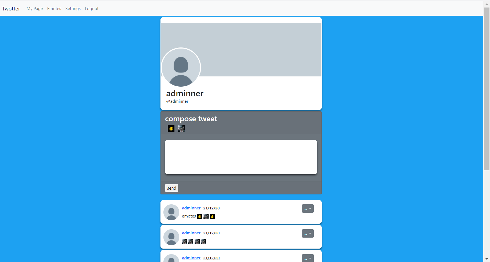

## About The Project
This is a flask app that provides a proof of concept as to how custom emotes could be integrated into twitter's mvp. 



## Installation Instructions
The app makes use of the venv pip package to create a virtual environment. Therefore the package will need to be installed in order to run the app. Thereafter the install instructions are as below **(Linux Only)**:

- Clone the repo
```git clone github.com/mo-ccc/twitter_extended.git```
- Change Directory into the src folder
```cd twitter_extended/src```
- Make sure venv is installed then run:
```sudo apt-get install python3-venv```
- Create the virtual environment:
```python3 -m venv venv```
- Activate the virtual environment:
```source venv/bin/activate```
- Update pip
```pip install --upgrade pip```
- Install the dependencies from requirments.txt: 
```pip install -r requirements.txt```
- clone the .env.example file as a new file named .env
```cp .env.example .env```
- replace the already filled fields with your own.
- upgrade the connected database
```flask db upgrade```
- export the FLASK_APP environment variable to app.py
```export FLASK_APP=app.py```
- export the FLASK_ENV environment variable to production
```export FLASK_ENV=production```
- run gunicorn on the port of your choice
```gunicorn -b 0.0.0.0:{port} "main:create_app"```

Note: It is recommended to setup the web server with https to secure session cookies. See nginx.


## Additional Commands
- ```flask db_cli create_admin``` will allow an account to be created from the terminal with the is_admin property set to true. This allows the account to access the hidden /admin endpoint where the database can be dumped and statistics on users can be viewed.

- ```flask db_cli drop``` deletes all data from the database. Run ```flask db upgrade``` afterwards to rebuild the tables.

## Live version
A live version will be available on January 3. It will be available at the domain:
twitterextended.ml
